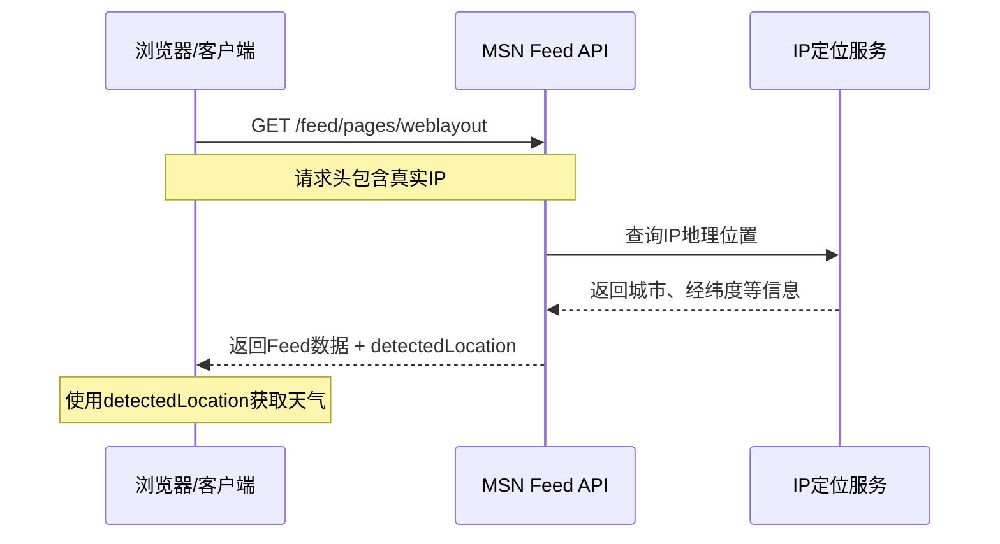

# MSN IP定位API逆向分析报告

## 🎯 核心发现

MSN通过**服务端IP定位**自动获取用户当前城市，无需客户端主动传递位置信息。

## 📡 位置信息来源

### 1. 服务端自动检测 (detectedLocation)

MSN Feed API **自动根据请求IP返回位置信息**，包含在响应的 `userProfile.detectedLocation` 字段中：

```json
{
  "userProfile": {
    "locationSettingMode": "1",
    "location": {
      "Country": "中华人民共和国",
      "CountryCode": "CN",
      "State": "天津市",
      "City": "天津市",
      "PostalCode": "300110",
      "IsLocalized": true,
      "Accuracy": 323.240234375,
      "PopIpDialog": false,
      "Latitude": 39.09427261352539,
      "Longitude": 117.15687561035156
    },
    "detectedLocation": {
      "Country": "中华人民共和国",
      "CountryCode": "CN",
      "State": "天津市",
      "City": "天津市",
      "PostalCode": "300110",
      "IsLocalized": true,
      "Accuracy": 323.240234375,
      "PopIpDialog": false,
      "Latitude": 39.09427261352539,
      "Longitude": 117.15687561035156
    },
    "followedLocations": []
  }
}
```

### 2. 位置字段说明

| 字段 | 说明 | 示例值 |
|------|------|--------|
| `Country` | 国家名称 | "中华人民共和国" |
| `CountryCode` | 国家代码 | "CN" |
| `State` | 省/州 | "天津市" |
| `City` | 城市 | "天津市" |
| `PostalCode` | 邮政编码 | "300110" |
| `IsLocalized` | 是否已定位 | true |
| `Accuracy` | 精度(米) | 323.240234375 |
| `PopIpDialog` | 是否弹出IP对话框 | false |
| `Latitude` | 纬度 | 39.09427261352539 |
| `Longitude` | 经度 | 117.15687561035156 |

## 🔍 MSN Feed API 请求

### API地址
```
https://assets.msn.cn/service/news/feed/pages/weblayout
```

### 请求参数

```javascript
{
  User: 'm-13A1CAFD74C4677709ACDC3875B96665',  // 任意用户ID
  activityId: generateActivityId(),              // UUID
  apikey: '0QfOX3Vn51YCzitbLaRkTTBadtWpgTN8NZLW0C1SEM',
  audienceMode: 'adult',
  cm: 'zh-cn',
  it: 'edgeid',
  ocid: 'hponeservicefeed',
  column: 'c2',
  colwidth: 300,
  contentType: 'article,video,slideshow,webcontent',
  newsTop: 48,
  newsSkip: 0
}
```

**关键点**：
- ✅ **不需要传递IP地址**
- ✅ **服务端自动从HTTP请求头中获取客户端IP**
- ✅ **自动进行IP地理位置解析**
- ✅ **返回精确到城市级别的位置信息**

## 🌐 IP定位工作流程



## 🎯 实现自己的IP定位

### 方案一：使用第三方IP定位API

#### 1. 高德地图IP定位 (推荐)
```javascript
async function getLocationByIP() {
  const response = await fetch(
    'https://restapi.amap.com/v3/ip?key=YOUR_KEY'
  );
  const data = await response.json();
  
  return {
    province: data.province,
    city: data.city,
    adcode: data.adcode,
    rectangle: data.rectangle  // 经纬度范围
  };
}
```

申请地址：https://lbs.amap.com/api/webservice/guide/api/ipconfig

#### 2. 腾讯位置服务
```javascript
async function getLocationByIP() {
  const response = await fetch(
    'https://apis.map.qq.com/ws/location/v1/ip?key=YOUR_KEY&output=jsonp'
  );
  const data = await response.json();
  
  return {
    nation: data.result.ad_info.nation,
    province: data.result.ad_info.province,
    city: data.result.ad_info.city,
    lat: data.result.location.lat,
    lng: data.result.location.lng
  };
}
```

申请地址：https://lbs.qq.com/service/webService/webServiceGuide/webServiceIp

#### 3. ip-api.com (免费，无需KEY)
```javascript
async function getLocationByIP() {
  const response = await fetch(
    'http://ip-api.com/json/?lang=zh-CN'
  );
  const data = await response.json();
  
  return {
    country: data.country,
    regionName: data.regionName,
    city: data.city,
    lat: data.lat,
    lon: data.lon,
    timezone: data.timezone
  };
}
```

### 方案二：Node.js服务端实现

```javascript
const axios = require('axios');
const requestIp = require('request-ip');

// Express中间件获取客户端真实IP
app.use(requestIp.mw());

app.get('/api/detect-location', async (req, res) => {
  const clientIp = requestIp.getClientIp(req);
  
  // 调用高德IP定位API
  const response = await axios.get('https://restapi.amap.com/v3/ip', {
    params: {
      key: 'YOUR_AMAP_KEY',
      ip: clientIp
    }
  });
  
  res.json({
    ip: clientIp,
    location: response.data
  });
});
```

## 🏆 城市ID映射表

MSN使用的城市代码来自**中国天气网**：

| 城市代码 | 城市名称 | 说明 |
|---------|---------|------|
| 101030100 | 天津 | 来自 source.id |
| 101010100 | 北京 | |
| 101020100 | 上海 | |

**获取更多城市代码**：
- 中国天气网城市列表：http://www.weather.com.cn/data/city3jdata/china.html
- 或从MSN返回的 `source.id` 字段直接获取

## 💡 实战应用

### 完整示例：获取当前城市天气

```javascript
const axios = require('axios');

// 1. 获取IP定位
async function getLocationByIP() {
  const response = await axios.get('http://ip-api.com/json/?lang=zh-CN');
  return {
    city: response.data.city,
    lat: response.data.lat,
    lon: response.data.lon
  };
}

// 2. 根据城市获取天气
async function getWeatherByLocation(location) {
  const msnResponse = await axios.get(
    'https://assets.msn.cn/service/news/feed/pages/weblayout',
    {
      params: {
        User: 'm-' + Math.random().toString(36).substring(2),
        activityId: generateUUID(),
        apikey: '0QfOX3Vn51YCzitbLaRkTTBadtWpgTN8NZLW0C1SEM',
        audienceMode: 'adult',
        cm: 'zh-cn'
      }
    }
  );
  
  // MSN会自动根据IP返回对应城市的天气
  const weatherCard = msnResponse.data.sections[1].cards
    .find(card => card.type === 'WeatherSummary');
    
  return JSON.parse(weatherCard.data);
}

// 3. 主函数
async function main() {
  const location = await getLocationByIP();
  console.log('检测到的位置:', location);
  
  const weather = await getWeatherByLocation(location);
  console.log('天气信息:', weather.responses[0].weather[0].current);
}

main();
```

## 🔑 关键洞察

1. **MSN不使用客户端地理位置API**
   - 不依赖 `navigator.geolocation`
   - 完全由服务端根据IP自动识别

2. **精度较高**
   - 精确到城市级别
   - 提供经纬度坐标（精度约300米）
   - 包含邮政编码

3. **隐私友好**
   - 不需要用户授权
   - 不弹出位置权限请求
   - 基于IP的粗略定位

4. **可靠性高**
   - 服务端控制，不受浏览器限制
   - 不依赖用户设备GPS
   - 跨平台一致性好

## 📝 总结

MSN的IP定位方案核心是：
- ✅ **服务端根据HTTP请求IP自动定位**
- ✅ **Feed API自动在响应中返回位置信息**
- ✅ **客户端直接使用返回的位置数据请求天气**

要复现这个功能，你需要：
1. 接入第三方IP定位服务（高德/腾讯/ip-api）
2. 在服务端获取客户端真实IP
3. 调用IP定位API获取城市信息
4. 将位置信息用于天气查询

---

📅 **分析时间**: 2025-12-18  
🔧 **工具**: Chrome DevTools + Puppeteer  
📊 **数据来源**: MSN Feed API 实际响应
