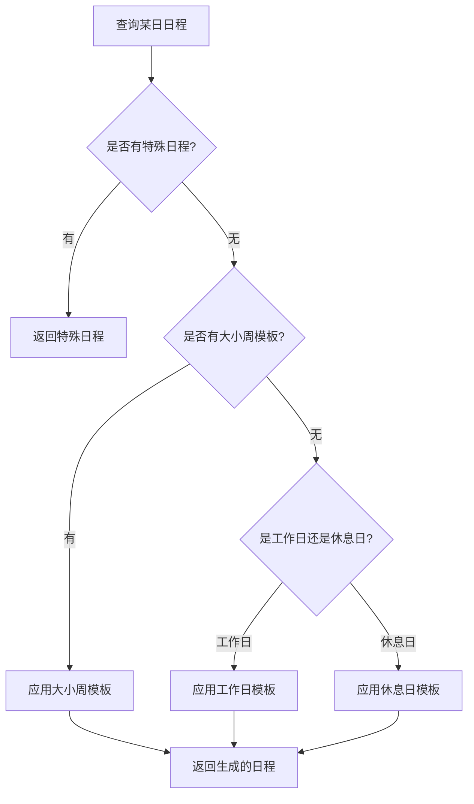

# 🎯 日程层级体系实现总结

## ✅ 已完成的功能

### 1. 核心模型 (Models)

#### `SchedulePriority` 枚举 (`lib/models/schedule_priority.dart`)
定义了四层优先级体系：
- **Priority 1**: 默认每日日程（最低）
- **Priority 2**: 工作日/休息日模板
- **Priority 3**: 大小周模板
- **Priority 4**: 特殊日程（最高）

#### `TemplateType` 枚举
定义了模板类型：
- `none` - 普通日程
- `workday` - 工作日模板
- `restday` - 休息日模板
- `bigWeek` - 大周模板
- `smallWeek` - 小周模板

#### `RecurrencePattern` 枚举
定义了重复周期：
- `none` - 不重复
- `daily` - 每天
- `weekly` - 每周
- `biweekly` - 每两周
- `monthly` - 每月

#### 扩展的 `Schedule` 模型 (`lib/models/schedule.dart`)
新增字段：
```dart
SchedulePriority priority;      // 优先级
TemplateType templateType;       // 模板类型
RecurrencePattern recurrence;    // 重复周期
String? sourceTemplateId;        // 源模板ID
bool allowOverride;              // 是否允许被覆盖
```

#### `ScheduleTemplate` 模型 (`lib/models/schedule_template.dart`)
用于存储可重用的日程模板：
```dart
String title;
TemplateType templateType;
SchedulePriority priority;
String? startTime;  // "HH:mm"
String? endTime;    // "HH:mm"
int sortOrder;
bool isEnabled;
```

---

### 2. 数据库升级 (`lib/services/database_service.dart`)

#### 新增表：`schedule_templates`
存储日程模板数据

#### 扩展表：`schedules`
新增字段：
- `priority` - 优先级（1-4）
- `template_type` - 模板类型
- `recurrence` - 重复周期
- `source_template_id` - 源模板ID
- `allow_override` - 是否允许被覆盖

#### 数据库版本升级
- 版本 1 → 版本 2
- 自动迁移旧数据
- 添加必要的索引

#### 新增方法
```dart
// 模板操作
insertTemplate(ScheduleTemplate)
updateTemplate(ScheduleTemplate)
deleteTemplate(String id)
getTemplatesByType(TemplateType)
getAllTemplates()
updateTemplateSortOrder(List<String>)
```

---

### 3. 模板服务 (`lib/services/template_service.dart`)

#### 核心功能

##### 模板管理
- `saveTemplate()` - 保存单个模板
- `saveTemplates()` - 批量保存模板
- `getTemplates()` - 获取指定类型的模板
- `deleteTemplate()` - 删除模板

##### 日程生成
- `generateSchedulesForDate()` - 为指定日期生成日程
  - 自动按优先级应用模板
  - 特殊日程 → 大小周 → 工作日/休息日

##### 模板应用
- `applyTemplatesToDate()` - 应用模板到指定日期
  - 根据优先级覆盖现有日程
- `applyTemplatesToRange()` - 批量应用到日期范围

##### 辅助方法
- `getBiweeklyType()` - 获取大小周类型
- `isValidTimeFormat()` - 验证时间格式
- `formatTime()` - 格式化时间

---

### 4. 自然语言命令解析器 (`lib/services/nlp_command_parser.dart`)

#### 支持的命令格式

##### 1. 创建日程
```
创建 [日期] [标题] 在 [时间]
```
示例：
- `创建 今天 晨跑 在 06:00-07:00`
- `创建 2024-11-25 开会 在 14:00-15:30 描述:讨论项目进度`

##### 2. 修改日程
```
修改 [日期] 的 [标题] 为 [新内容]
```
示例：
- `修改 今天 的 晨跑 为 晨跑+冥想`
- `修改 2024-11-25 的 开会 时间为 15:00-16:00`

##### 3. 删除日程
```
删除 [日期] 的 [标题]
```
示例：
- `删除 今天 的 晨跑`

##### 4. 完成日程
```
完成 [标题]
```
示例：
- `完成 晨跑`

##### 5. 设置模板
```
设置[模板类型]: [日程列表]
```
示例：
- `设置工作日模板: 06:00-07:00 晨跑, 09:00-18:00 工作, 19:00-20:00 学习`

##### 6. 查询日程
```
查询 [日期] 的日程
```
示例：
- `查询 今天 的日程`

#### 命令解析功能
- 日期识别：今天、明天、后天、yyyy-MM-dd
- 时间提取：HH:mm-HH:mm
- 优先级识别：特殊、重要等关键词
- 描述提取：支持 `描述:xxxxx` 格式

---

### 5. 文档和示例

#### `日程层级体系与自然语言规范.md`
完整的系统设计文档，包含：
- 优先级层级说明
- 自然语言命令规范
- 使用场景示例
- GPT 集成建议
- 数据结构说明

#### `lib/examples/schedule_system_example.dart`
代码使用示例，包含：
- 设置工作日模板
- 设置大小周模板
- 使用自然语言命令
- 优先级覆盖演示
- 批量生成日程
- 突发情况调整

---

## 🎨 系统架构

```
┌─────────────────────────────────────────┐
│         用户界面 (UI Layer)              │
│  - 聊天框                                │
│  - 日程列表                              │
│  - 日历视图                              │
└─────────────────┬───────────────────────┘
                  │
┌─────────────────▼───────────────────────┐
│    自然语言解析器 (NLP Layer)            │
│  - 命令解析                              │
│  - 参数提取                              │
│  - 命令执行                              │
└─────────────────┬───────────────────────┘
                  │
┌─────────────────▼───────────────────────┐
│      模板服务 (Template Service)         │
│  - 模板管理                              │
│  - 优先级覆盖                            │
│  - 日程生成                              │
└─────────────────┬───────────────────────┘
                  │
┌─────────────────▼───────────────────────┐
│     数据库服务 (Database Service)        │
│  - schedules 表                          │
│  - schedule_templates 表                 │
│  - SQLite 本地存储                       │
└─────────────────────────────────────────┘
```

---

## 🔄 优先级覆盖逻辑流程



---

## 📝 下一步集成 GPT 的建议

### 1. 创建聊天界面

在 `lib/screens/` 下创建 `chat_screen.dart`：
- 聊天消息列表
- 输入框
- 发送按钮
- 历史记录

### 2. 集成 OpenAI API

创建 `lib/services/gpt_service.dart`：
```dart
class GPTService {
  final String apiKey;
  
  Future<String> chat(String userMessage, List<Schedule> schedules) async {
    // 1. 构建上下文（包含当前日程）
    // 2. 调用 OpenAI API
    // 3. 解析返回的命令
    // 4. 调用 NLPCommandParser 执行
  }
}
```

### 3. 系统提示词 (System Prompt)

```
你是一个专业的日程管理助手。你可以帮助用户：
1. 创建、修改、删除日程
2. 设置日程模板
3. 处理突发情况，智能调整日程

你必须使用以下标准命令格式：
- 创建日程: 创建 [日期] [标题] 在 [时间]
- 修改日程: 修改 [日期] 的 [标题] 为 [新内容]
- 删除日程: 删除 [日期] 的 [标题]
- 完成日程: 完成 [标题]
- 设置模板: 设置[模板类型]: [日程列表]
- 查询日程: 查询 [日期] 的日程

当前日程优先级：
- 特殊日程（Priority 4）最高，不可覆盖
- 大小周模板（Priority 3）
- 工作日/休息日模板（Priority 2）
- 默认日程（Priority 1）最低

当用户反馈突发情况时，请：
1. 分析时间冲突
2. 重新安排低优先级任务
3. 保留核心任务
4. 给出调整建议
```

### 4. 对话流程示例

**用户**: 今天下午2点有个紧急会议，帮我调整一下

**GPT 分析**:
1. 查询今天的日程
2. 检测 14:00-16:00 的冲突
3. 识别低优先级任务
4. 生成调整方案

**GPT 执行命令**:
```
创建 今天 紧急会议 在 14:00-16:00
修改 今天 的 学习 时间为 16:30-18:00
```

**GPT 回复用户**:
"已为您安排今天下午2点的紧急会议，并将学习时间调整到下午4:30-6:00。"

---

## 🚀 使用方法

### 1. 设置工作日模板

```dart
final result = await nlpParser.parseAndExecute(
  '设置工作日模板: 06:00-07:00 晨跑, 09:00-18:00 工作, 19:00-21:00 学习'
);
```

### 2. 创建特殊日程

```dart
final result = await nlpParser.parseAndExecute(
  '创建 今天 紧急会议 在 14:00-15:30 描述:客户需求讨论'
);
```

### 3. 查询日程

```dart
final result = await nlpParser.parseAndExecute('查询 今天 的日程');
print(result);
// 输出:
// 2024-11-24 的日程:
// ○ 06:00 - 07:00 晨跑
// ○ 09:00 - 18:00 工作
// ○ 14:00 - 15:30 紧急会议
// ○ 19:00 - 21:00 学习
```

---

## 📚 相关文件

- `lib/models/schedule_priority.dart` - 优先级定义
- `lib/models/schedule_template.dart` - 模板模型
- `lib/models/schedule.dart` - 日程模型（已扩展）
- `lib/services/database_service.dart` - 数据库服务（已升级）
- `lib/services/template_service.dart` - 模板服务
- `lib/services/nlp_command_parser.dart` - 自然语言解析器
- `lib/examples/schedule_system_example.dart` - 使用示例
- `日程层级体系与自然语言规范.md` - 设计文档

---

## ✨ 特性亮点

1. **四层优先级体系** - 灵活且清晰的日程覆盖逻辑
2. **模板复用** - 避免重复创建相似日程
3. **自然语言命令** - 易于人类和 AI 理解
4. **智能覆盖** - 高优先级自动覆盖低优先级
5. **轻量化** - 本地 SQLite 存储，跨平台支持
6. **GPT 友好** - 标准化命令格式，便于集成

---

**开发者**: 自律助手开发团队  
**日期**: 2024-11-24  
**版本**: 1.0
